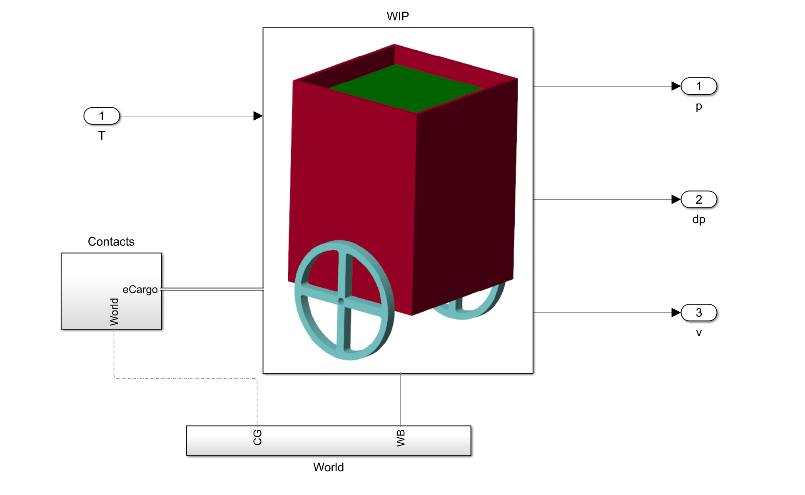

Wheeled Inverted Pendulum (WIP) Control Project
===============================================

# Introduction
This project focuses on the modeling and control of a Wheeled Inverted Pendulum (WIP) system. The WIP is modeled using a multibody approach to capture the physical dynamics accurately.

# Project Scope
The primary educational goal of this project is to demonstrate and compare different control strategies for balancing the WIP system. Specifically, it highlights the performance differences between:
- **Cascade Controller**: A classical control approach using nested loops.
- **LQR Controller**: A Linear Quadratic Regulator approach for optimal control.

# Modeling and Linearization
The project utilizes a nonlinear reduced-order model of the WIP. This model is crucial for performing linearization, which facilitates the design of the linear controllers (like LQR) around an operating point (typically the upright equilibrium position).

# Repository Structure

The repository is organized as follows:

## Models (`models/`)
Contains the Simulink models used for simulation and control design.
- `WIP_mb_model.slx`: The high-fidelity Multibody model of the WIP.
- `WIP_nl_model.slx`: The nonlinear reduced-order model used for analysis and linearization.
- `control_cascade.slx`: Implementation of the cascade control strategy.
- `control_lqr.slx`: Implementation of the LQR control strategy.
- `control_lqr_integral.slx`: LQR controller with integral action.
- `control_comparison.slx`: A model setup to compare the different controllers side-by-side.
- `WIP.slx`: Reference subsystem used as the main simulation entry point.

## Scripts (`scripts/`)
Contains MATLAB scripts for initialization and data management.
- `initialization.m`: Script to initialize parameters and workspace variables before running simulations.
- `WIP_DataFile.m`: Defines the physical parameters and data for the WIP system.

